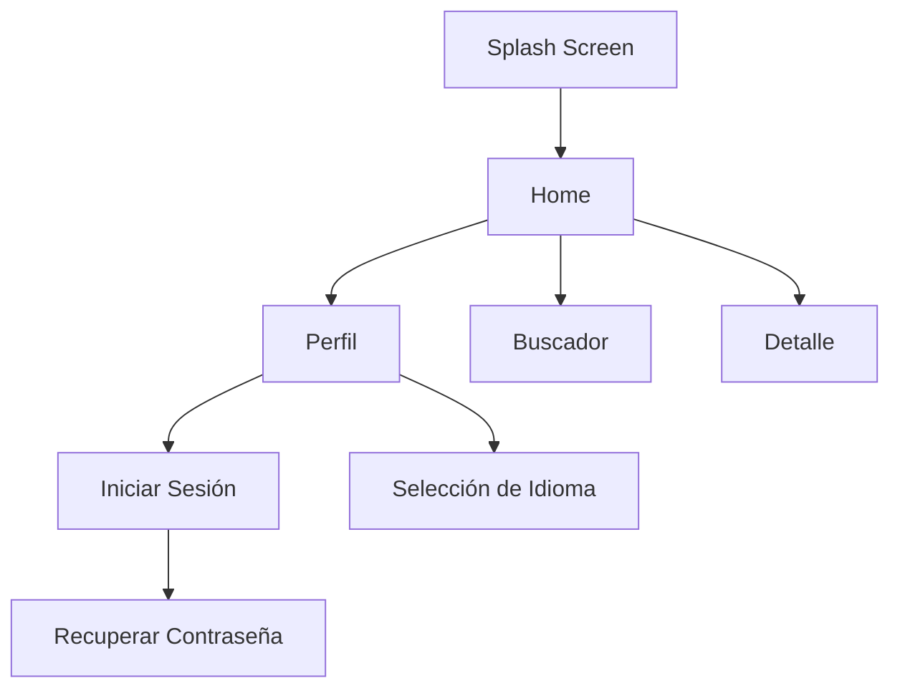
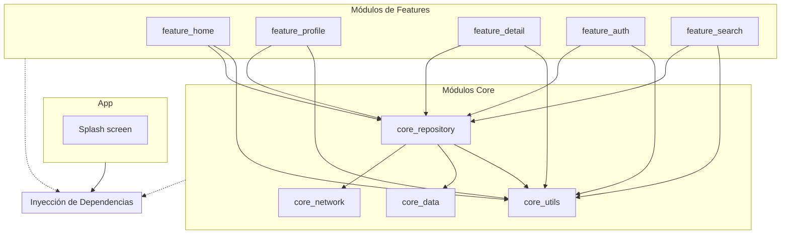
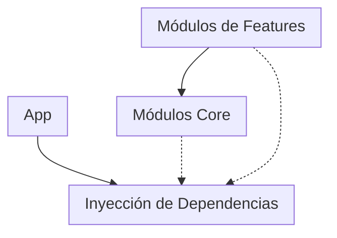

# Diagrama de Navigación de la App

El diagrama de navegación de la aplicación muestra cómo los usuarios pueden interactuar con las
diferentes pantallas y funciones de la app. A continuación se presenta el diagrama en formato
Mermaid:

# Arquitectura de la app

La arquitectura de la aplicación está basada en el patrón de diseño MVVM (Modelo-Vista-ViewModel) y utiliza la inyección de dependencias para gestionar las dependencias entre los diferentes módulos. A
continuación se presenta un diagrama que ilustra la arquitectura de la app:

# Diagrama funcional
El diagrama funcional de la aplicación muestra cómo los diferentes módulos interactúan entre sí y
cómo se comunican a través de la inyección de dependencias. A continuación se presenta el diagrama
en formato Mermaid:

